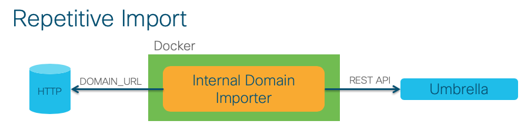

# Umbrella Internal Domain Importer

## Summary

This is proof-of-concept code to import a list of domains from a CSV file or URL into Cisco Umbrella as Internal Domains.  Internal Domains cause Umbrella Virtual Appliances and Roaming Clients to pass through the specified domains to their local resolvers.  This is most commonly used for internal domain resolution - as the name implies - but can be used in other scenarios as well.

An example use case for this is would be to import the domains of a globally distributed cloud application in order access a more localized datacenter, rather than using the "closest" datacenter from the perspective of Umbrella.  This can also help with Chinese domains where "mainland" resolution is desired.  Umbrella doesn't currently have a datacenter in mainland China, so most Chinese domain resolution will return the non-mainland/externally available IPs.

This code essentially has two operating modes.  An ad-hoc import can be performed simply by running the script with python, or repetitive imports can be performed by running the script with the "-d" argument or as a container.

For ad-hoc updates, it's recommended to use a CSV file and configure the DOMAIN_CSV environment variable in the **.env** file.


For repetitive updates, it's recommended to fetch updates from a web server by configuring the DOMAIN_URL environment variable in the **.env** file.



## Requirements

1. Python 3.6+
2. Umbrella Organization ID
3. Umbrella Management API Credentials
    - Instructions for creating API credentials can be found [here](https://docs.umbrella.com/umbrella-api/docs/management-api-documentation).

> OPTIONAL: If running this application as a container, you'll also need Docker.

## How To Run

1. Prior to running the script for the first time, copy the ***.env.example*** to ***.env***.
    * ```cp .env.example .env```
2. Open the ***.env*** file and configure the file and Umbrella parameters.
    - DOMAIN_CSV: The file name of the CSV file containing the desired domains. (String)
    - DOMAIN_URL: A URL containing the desired domains, one domain per line. (String)
    - INTERVAL: The refresh interval, in seconds, between subsequent checks when running as a daemon. (Integer)
    - UMBRELLA_API_ORG_ID: The Organization ID of your Umbrella instance. (Integer)
    - UMBRELLA_API_MANAGEMENT_KEY: The Umbrella Management API Key to be used. (String)
    - UMBRELLA_API_MANAGEMENT_SECRET: The Umbrella Management API Secret to be used. (String)
2. Install the required packages from the ***requirements.txt*** file.
    * ```pip install -r requirements.txt```
    * If running locally, you'll probably want to set up a virtual environment: [Python 'venv' Tutorial](https://docs.python.org/3/tutorial/venv.html)
    * Activate the Python virtual environment, if you created one.
4. Run the script with ```python umbrella_internal_domains.py```

## Docker Container

This script is Docker friendly, and can be deployed as a container.  Once the ***.env*** file is populated, run the following command to build the container:

- ```docker build -t umbrella-internal-domains .```

You can then run the container as a daemon with the following command:

- ```docker run -d --name umbrella-internal-domains umbrella-internal-domains```
